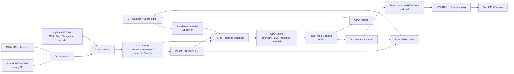
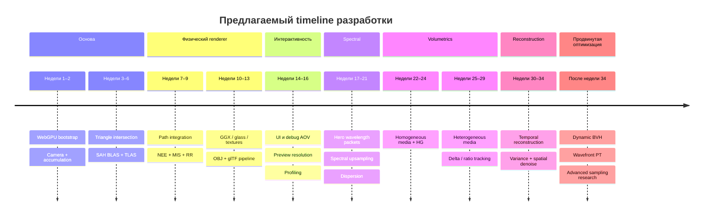

# WebGPU path tracing рендер-движок на TypeScript для браузера: архитектура, алгоритмы и план реализации

## Executive summary

По состоянию на **30 сентября 2026 года** WebGPU и WGSL находятся на зрелой стадии стандартизации: актуальный WebGPU опубликован W3C как Candidate Recommendation Draft от 15 сентября 2026 года, а WGSL — Candidate Recommendation Draft от 21 сентября 2026 года. WebGPU предоставляет переносимые graphics/compute-возможности, но для браузерного path tracer практическая переносимая архитектура сегодня — это **software ray traversal в WGSL compute shaders поверх собственного BVH**, а не зависимость от DXR/Vulkan-RT-подобного аппаратного ray-tracing pipeline. Это именно тот подход, который используют существующие браузерные WebGPU path tracacer-проекты. citeturn13view0turn13view2turn6view1

**Главная рекомендация:** строить движок как GPU-first path tracer с TypeScript в роли control plane, а WebAssembly подключать не к основному циклу трассировки, а к тяжёлой подготовке данных: парсингу больших OBJ, построению высококачественного SAH-BVH, генерации геометрических атрибутов, декодированию/транскодированию ресурсов и, возможно, спектральной предобработке. WebAssembly имеет смысл выполнять в Worker; многопоточный Wasm через pthreads требует соответствующей конфигурации shared memory/cross-origin isolation. citeturn20view2turn19search1

Целевую архитектуру имеет смысл строить вокруг **двухуровневого BVH: BLAS для мешей + TLAS для instances**. Для статических OBJ/мешей предпочтителен SAH-BVH: он дороже строится, но даёт более качественное дерево. Для частых перестроений стоит иметь HLBVH/LBVH или refit-путь. PBRT прямо сопоставляет SAH и HLBVH: HLBVH быстрее и легче параллелизуется, но обычно уступает SAH по качеству полученного дерева; GPU-параллельный LBVH хорошо изучен в работе Karras. Для анимации разумна схема `refit → измерение деградации → периодический rebuild`. citeturn20view0turn9search0turn9search6

Базовый интегратор должен быть **unidirectional path tracing + next-event estimation + importance sampling + MIS + Russian roulette**. NEE и BSDF/light MIS дают принципиально меньшую дисперсию, чем чистый random walk; именно такую структуру использует современный reference path tracer PBRT. BDPT/VCM полезны прежде всего для сложных каустик и трудных light paths, но сильно хуже ложатся на первую браузерную GPU-реализацию из-за irregular control flow, соединения под-путей и дополнительного состояния. citeturn8view0turn8view2turn8view3

Для спектральной части наиболее прагматичен не полный массив из десятков wavelength bins на каждый ray, а **wavelength packet / hero wavelength sampling**. Hero Wavelength Spectral Sampling был специально предложен для распространения небольшого постоянного числа длин волн по пути; хороший компромисс для WebGPU — четыре wavelength lanes в `vec4f`. RGB-текстуры можно преобразовывать в спектральное представление через компактную spectral upsampling-функцию; метод Jakob и Hanika позволяет хранить компактные коэффициенты и дешёво восстанавливать значение спектра в конкретной λ. PBRT v4 целиком перешёл на спектральный transport и демонстрирует, что такой подход естественно поддерживает wavelength-dependent refraction/dispersion и хроматические среды. citeturn10search32turn10search6turn10search2turn11search4

Для volumetrics следует идти по ступеням: сначала homogeneous medium, затем heterogeneous density grid с majorants и delta tracking; для shadow/transmittance rays — ratio tracking; первая phase function — Henyey–Greenstein. PBRT v4 использует именно разделение на sampling реального пути через delta/null-collision tracking и оценивание transmittance через ratio tracking, включая multiple scattering. citeturn16view0turn16view1turn17view0turn17view1turn17view2

Для интерактивности я бы **не пытался добиться визуально чистых 30–60 FPS исключительно количеством samples**. Практичная стратегия — 1 spp или меньше эффективной работы на display frame, temporal accumulation, сниженное разрешение во время движения камеры и GPU denoising. SVGF показал реконструкцию temporally stable изображения из порядка одного path per pixel, используя temporal accumulation, variance estimates и hierarchical wavelet filtering. citeturn17view3

Критическое ограничение — память. Один `RGBA32F` accumulator занимает около **31,6 MiB в 1080p, 56,3 MiB в 1440p и 126,6 MiB в 4K**. Минимально гарантируемый `maxStorageBufferBindingSize` WebGPU составляет 128 MiB, а `maxBufferSize` — 256 MiB, поэтому простая схема `array<vec4f>` для 4K accumulator практически упирается в portable binding limit ещё до BVH, geometry и AOV. Значит, 4K следует проектировать через storage textures, tiles/chunks либо рендеринг в меньшем внутреннем разрешении; реальные limits необходимо запрашивать у adapter/device, а не зашивать константами. citeturn14search0

Рекомендуемый порядок разработки:

**RGB path tracer → SAH BVH + MIS/NEE → textures/OBJ → robust dielectric/GGX → progressive interaction → spectral packet → dispersion → homogeneous volumes → heterogeneous volumes → GPU denoiser → dynamic BVH/wavefront refinements.**

Полный одновременно spectral + volumetric + dynamic + denoised browser renderer — проект высокой сложности. Для одного опытного graphics engineer моя оценка до качественного исследовательского renderer — примерно **5–8 месяцев**, при условии что editor/DCC, production asset pipeline и полноценный MaterialX/OpenPBR compiler не входят в scope. Это инженерная оценка, а не опубликованный benchmark.

## Технологический стек и рекомендуемая архитектура

WebGPU хорошо подходит к этой задаче именно потому, что path tracing можно выразить как general-purpose compute workload: лучи, BVH traversal, BSDF sampling и накопление являются обычными compute kernels. WGSL при этом имеет storage buffers/textures, compute stages, workgroups, memory model и в актуальной спецификации также subgroup primitives, хотя subgroup-оптимизации следует рассматривать как дополнительный fast path, а не основу корректности. citeturn13view2

### Разделение ответственности

Оптимальное разделение выглядит так:

| Компонент | Где выполнять | Причина |
|---|---|---|
| Ray generation, BVH traversal | WebGPU/WGSL | массивный parallel workload |
| Surface intersections | WebGPU/WGSL | нет CPU↔GPU round-trip |
| BSDF/BTDF, Fresnel, spectral transport | WebGPU/WGSL | выполняется на каждый bounce |
| NEE/MIS/shadow rays | WebGPU/WGSL | часть integrator |
| Volume tracking | WebGPU/WGSL | слишком много событий для CPU |
| Accumulation, AOV | WebGPU | не читать radiance обратно на CPU |
| Denoising | преимущественно WebGPU | избежать readback и обеспечить frame-local pipeline |
| UI/camera/scene editing | TypeScript | сложная логика, DOM |
| Manifest/scene validation | TypeScript | простота, диагностируемость |
| Async asset loading | TypeScript + Worker | не блокировать UI |
| OBJ parsing | TS для малых сцен; Worker/WASM для больших | CPU preprocessing |
| SAH BVH build | Worker/WASM сначала | сложная нерегулярная CPU-задача |
| HLBVH/LBVH build | WASM или позднее GPU | при очень частой перестройке |
| Texture decode/transcode | Worker/WASM при необходимости | CPU-intensive codecs |
| Tangent/normal generation | Worker/WASM | preprocessing |
| Профайлинг GPU | WebGPU timestamp queries | измерение GPU passes |

В основной поток WASM **не следует помещать только потому, что он потенциально быстрее JavaScript**. Когда shader уже владеет geometry/BVH, выполнение bounce на CPU/WASM потребовало бы синхронизации с GPU и разрушало бы главное преимущество архитектуры. Wasm особенно полезен там, где можно взять существующий оптимизированный Rust/C/C++ алгоритм, дать ему большой блок входных данных и получить другой большой блок данных один раз или редко. Emscripten документирует pthreads-based threading для такого кода; многопоточный web deployment требует соответствующей shared-memory конфигурации. citeturn20view2turn19search1

### Рекомендуемый toolchain

| Слой | Рекомендация | Комментарий |
|---|---|---|
| Язык приложения | TypeScript `strict` | renderer API, loaders, resource ownership |
| WebGPU typings | `@webgpu/types` | официальный репозиторий GPUWeb предоставляет `.d.ts` для WebGPU. citeturn19search3 |
| Shaders | WGSL | стандартный shading language WebGPU. citeturn13view2 |
| Bundler/dev server | Vite | предпочтительнее для нового проекта; WGSL импортировать как raw source |
| Shader struct helper | `webgpu-utils` либо собственный layout generator | существующий WebGPU path tracer использует `webgpu-utils` для согласования JS/WGSL data layouts. citeturn6view1 |
| Math | `gl-matrix` или собственные packed functions | `gl-matrix` уже применяется в WebGPU path-tracing проекте daikiad. citeturn6view1 |
| UI | `lil-gui` | очень удобно для integrator/debug controls; также используется в существующей реализации. citeturn6view1 |
| Camera controls | Three.js OrbitControls или собственные | Three.js удобно оставить только для tooling/UI, не как renderer core. citeturn6view1 |
| Mesh preprocessing | `meshoptimizer` / Wasm | проект включает оптимизацию meshes и `gltfpack`, полезен для offline/pre-load pipeline. citeturn21search3 |
| Wasm C/C++ | Emscripten | особенно если используются существующие C/C++ geometry libraries. citeturn20view2 |
| Wasm Rust | wasm-bindgen-style bridge | разумная альтернатива C++, особенно для собственного parser/BVH builder |
| Asset standard | glTF 2.0 + собственный scene manifest | glTF имеет стандартизированную структуру buffers, accessors, materials, images, nodes. citeturn20view3 |

Для GPU structs лучше не дублировать layout вручную десятками interface-типов. WGSL имеет строгие правила alignment/size для host-shareable structures. Поэтому либо определяйте layout декларативно и генерируйте и TS-view, и WGSL, либо держите WGSL source of truth и используйте reflection/helper. citeturn13view2

Например, BVH node можно уложить в удобные 32 байта:

```wgsl
struct BvhNode {
    boundsMin: vec3f,
    leftFirst: u32,

    boundsMax: vec3f,
    meta: u32,
}
```

`meta` можно кодировать как `primitiveCount` для leaf и flag/index для interior node. Такая структура хорошо подходит для последовательного traversal из storage buffer.

Для материалов вместо TypeScript class hierarchy, зеркально перенесённой на GPU, лучше использовать **tagged packed records**:

```ts
export const enum MaterialType {
  Diffuse = 0,
  Conductor = 1,
  Dielectric = 2,
  Microfacet = 3,
  Emissive = 4,
}

export interface MaterialCPU {
  type: MaterialType;
  baseColor: [number, number, number];
  roughness: number;
  metallic: number;
  ior: number;
  transmission: number;
  textureBaseColor?: number;
  textureNormal?: number;
  mediumInside?: number;
}
```

На WGSL-стороне это превращается в один или несколько SoA/packed buffers. Для GPU SoA нередко предпочтительнее глубокой объектной модели: shader сначала получает material ID, затем обращается только к нужным данным.

### Архитектурная схема



Такая организация близка к успешно работающим WebGPU path tracer-репозиториям: например, `daikiad/webgpu-path-tracer` уже разделяет `PathTracer`, WGSL shader, scene/BVH loader, materials, camera и UI; он также использует progressive accumulation, tile dispatch, GLB loader и debug/UI tooling. citeturn6view1

### Compute-loop

Минимальный TypeScript render pass должен быть почти «скучным»: вся физика находится в WGSL.

```ts
interface FrameState {
  sampleIndex: number;
  sceneRevision: number;
  lastSceneRevision: number;
}

function renderFrame(
  device: GPUDevice,
  pipeline: GPUComputePipeline,
  bindGroup: GPUBindGroup,
  width: number,
  height: number,
  state: FrameState,
): void {
  const reset = state.sceneRevision !== state.lastSceneRevision;

  if (reset) {
    state.sampleIndex = 0;
    state.lastSceneRevision = state.sceneRevision;
  }

  // Update only the small frame/camera uniform buffer here.

  const encoder = device.createCommandEncoder({
    label: "Path tracing frame",
  });

  const pass = encoder.beginComputePass({
    label: "Path tracing",
  });

  pass.setPipeline(pipeline);
  pass.setBindGroup(0, bindGroup);
  pass.dispatchWorkgroups(
    Math.ceil(width / 8),
    Math.ceil(height / 8),
  );
  pass.end();

  // Follow with denoise / tone-map / presentation passes.
  device.queue.submit([encoder.finish()]);

  state.sampleIndex++;
}
```

В WGSL один invocation в простом megakernel-варианте обслуживает pixel/sample:

```wgsl
struct FrameParams {
    width: u32,
    height: u32,
    sampleIndex: u32,
    resetAccumulation: u32,
};

@group(0) @binding(0)
var<uniform> frame: FrameParams;

@group(0) @binding(1)
var<storage, read_write> accumulation: array<vec4f>;

@compute @workgroup_size(8, 8)
fn pathTrace(@builtin(global_invocation_id) gid: vec3u) {
    if (gid.x >= frame.width || gid.y >= frame.height) {
        return;
    }

    let index = gid.y * frame.width + gid.x;

    var rng = initRng(index, frame.sampleIndex);
    let ray = generateCameraRay(gid.xy, rng);

    // Internally:
    // intersect BVH
    // evaluate emission
    // NEE + MIS
    // sample BSDF/phase
    // update throughput
    // Russian roulette
    let sampleXYZ = tracePath(ray, rng);

    if (frame.resetAccumulation != 0u) {
        accumulation[index] = vec4f(sampleXYZ, 1.0);
    } else {
        accumulation[index] += vec4f(sampleXYZ, 1.0);
    }
}
```

Это именно стартовая **megakernel** архитектура. PBRT v4 также документирует отдельный wavefront GPU path tracer, где стадии вынесены в queues/kernels; wavefront-подход становится всё привлекательнее по мере появления большого количества divergent workloads. citeturn20view1

## Алгоритмы трассировки, BVH и снижение дисперсии

Центральная задача интерактивного path tracer — не просто «проследить много лучей», а максимально уменьшить variance на каждый вычисленный ray. В браузере это особенно важно, поскольку portable WebGPU не даёт оснований предполагать наличие специализированного RT hardware interface.

### Базовая структура интегратора

Для каждого camera sample:

\[
L = L_e +
\sum_{b=0}^{N}
\beta_b
\left(
L_{\text{direct},b}
+
L_{\text{indirect},b}
\right)
\]

где throughput обновляется приблизительно как

\[
\beta_{b+1}
=
\beta_b
\frac{f(\omega_o,\omega_i)\,|\cos\theta|}
     {p_{\mathrm{BSDF}}(\omega_i)}.
\]

На каждом **не-delta** interaction стоит выполнять NEE: выбрать источник света и точку/направление на нём, запустить shadow ray и объединить light sampling с BSDF sampling через MIS. PBRT подчёркивает, что BSDF sampling и light sampling эффективны в разных ситуациях, а MIS позволяет комбинировать их без необходимости заранее знать, какая стратегия лучше для конкретного пути. citeturn8view0turn8view3

Практичный default:

```text
maxDepth            = 8
Russian roulette    = начиная с bounce 3–5
direct lighting     = 1 light sample / non-delta vertex
MIS heuristic       = power heuristic, β = 2
environment sampling= importance map
```

Численные параметры здесь — рекомендуемый starting point, а не стандартизованные значения.

### Сравнение методов

| Метод | Плюсы | Минусы | Рекомендация для WebGPU |
|---|---|---|---|
| Plain random-walk PT | минимальная сложность | огромный noise от малых/удалённых lights | только самый первый prototype |
| BSDF importance sampling | хорошо для glossy/specular lobes | плохо на малых emitters | обязательно |
| Next-event estimation | резко улучшает direct lighting | дополнительный shadow ray | обязательно |
| MIS: BSDF + light sampling | robust для разных light/BRDF конфигураций | нужно корректно считать PDFs и delta events | **обязательно**; reference — Veach/PBRT. citeturn8view0turn8view3 |
| Russian roulette | позволяет не задавать жёсткий маленький depth без bias | повышает variance при слишком раннем применении | после нескольких bounces; корректировать throughput на survival probability. citeturn8view0 |
| Environment importance sampling | огромный выигрыш с HDRI | нужен CDF/alias preprocess | высокий приоритет |
| Light power sampling | лучше uniform light selection при многих lights | нужен rebuild при изменении lights | высокий приоритет |
| BDPT | хорошо добирается до некоторых сложных transport paths | queues, storage, MIS намного сложнее | исследовательский этап; не MVP. citeturn8view2 |
| VCM/vertex merging | мощно для caustics/сложного transport | память, spatial structures, высокая сложность | только если каустики — ключевая цель |
| Reservoir-based/ReSTIR-class sampling | потенциально интересно при очень малом spp | отдельная система temporal/spatial state | после стабильного MIS path tracer; verified browser-specific implementation в данном исследовании — **неопределено** |

### BVH: рекомендуемая система

BVH естественно подходит браузеру: AABB tree позволяет полностью отбрасывать subtrees, которые ray не пересекает. PBRT использует BVH как стандартную acceleration structure и сравнивает SAH с HLBVH; итоговый BVH у него также переводится в компактное pointerless linear representation, что особенно актуально для GPU. citeturn20view0

Я рекомендую:

```text
Scene
 └── TLAS: object/instance bounds
       ├── Instance A → BLAS mesh A
       ├── Instance B → BLAS mesh B
       └── Instance C → BLAS mesh A
```

Это даёт несколько преимуществ: один OBJ не дублируется при instancing; transform объекта не требует перестраивать triangle BLAS; движение rigid object затрагивает в первую очередь TLAS.

**Статическая геометрия:** SAH BLAS.

**Большие меши, которые надо загрузить быстро:** HLBVH/LBVH как fast-build option, затем при наличии idle time можно перестроить качественный SAH tree. PBRT отмечает именно trade-off «быстрее build / хуже traversal» между HLBVH и SAH; Karras показывает эффективную параллельную конструкцию LBVH-подобных иерархий. citeturn20view0turn9search0

**Rigid animation:** refit TLAS bottom-up. Если surface area внутренних bounds постепенно становится значительно хуже исходной, выполнить rebuild. Методы динамического update/refit с последующими локальными улучшениями/rotations изучались специально для animated scenes. citeturn9search6

**Skinned/deforming geometry:** сначала refit BLAS; для серьёзной деформации — rebuild. Для первого browser engine skinning + dynamic BLAS я бы не включал в MVP.

Полезная debug-метрика:

\[
Q =
\frac{\sum_i A(\text{node}_i)}
     {A(\text{root})},
\]

либо более близкая к SAH cost оценка. Смысл не в конкретной формуле, а в том, чтобы после refit иметь дешёвый индикатор деградации и не rebuild-ить дерево каждый frame.

### Binary BVH или wide BVH

Начинать стоит с binary BVH. Он проще строится, проще проверяется и позволяет довести renderer до физически корректного состояния.

Далее возможны BVH4/BVH8:

**Плюсы:** меньше уровней, потенциально лучше использование SIMD/subgroups и меньше control-flow steps.

**Минусы:** более сложные node layouts, child ordering, sorting hits, больше register pressure.

Для WebGPU MVP binary SAH BVH предпочтительнее. Wide BVH — optimization milestone после реального profiling.

### Megakernel против wavefront

**Megakernel path tracer** содержит в одном shader invocation весь bounce loop. Его преимущества для браузера: минимум dispatches, простая state machine, простая accumulation, небольшой TypeScript scheduler.

Недостаток: diffuse, mirror, glass и volume paths быстро расходятся по control flow; один lane может закончить путь на bounce 2, соседний — пройти 12 null collisions и несколько refractions.

**Wavefront path tracer** пишет активные rays в queues и запускает отдельные kernels вроде:

```text
RayGen
  ↓
Intersect
  ↓
ShadeSurface ───→ ShadowQueue
  ↓
MediumSample
  ↓
NextRayQueue
  ↓
Intersect ...
```

PBRT v4 содержит отдельную GPU wavefront implementation, что делает эту архитектуру хорошим reference для второго поколения renderer. citeturn20view1

Для данного проекта я бы выбрал **megakernel до появления heterogeneous volumes**, после чего профилировал. Если divergence становится dominant cost, переходить к hybrid/wavefront renderer.

### Denoising

Для interactive mode эффективнее сохранять физически корректный raw accumulator и отдельно строить display output.

SVGF использует temporal accumulation, luminance variance и hierarchical wavelet filtering и был разработан именно для реконструкции крайне малосемплового path-traced GI. citeturn17view3

Минимальные buffers:

```text
radiance
albedo
normal
linear depth
motion vector      ← при temporal reprojection
luminance moments
history length
```

Pipeline:

```text
1 spp
  → reproject history
  → reject disocclusions
  → temporal accumulate
  → estimate variance
  → 3–5 A-Trous-style iterations
  → tone map
```

Для **статической камеры** progressive raw accumulation всё равно следует продолжать: denoiser является preview/reconstruction layer, а не заменой convergence.

Для moving camera history reject должен учитывать depth и normal discontinuities.

CPU-denoising в каждом interactive frame я не рекомендую из-за GPU readback/CPU processing/upload path. Возможность качественно упаковать конкретный production CPU denoiser в Wasm существует концептуально, однако статус и производительность конкретного OIDN-подобного browser deployment в рамках найденных первоисточников — **неопределено**. Основной путь лучше делать GPU-native.

## Спектральный transport, материалы и объёмные среды

Именно здесь проект перестаёт быть обычным «Ray Tracing in One Weekend на WebGPU» и становится серьёзным renderer.

### Спектральная модель

Не следует хранить, например, 81 spectral bin на каждом path state. При миллионах rays это слишком дорого по register/storage footprint.

Предпочтительная модель:

```wgsl
struct SpectralPacket {
    lambdaNm: vec4f,
    weight: vec4f,
}
```

То есть один ray несёт четыре длины волн. Первая/hero wavelength выбирается случайно согласно spectral sampling distribution, остальные строятся коррелированно/смещённо так, чтобы лучше покрывать спектр. Hero Wavelength Spectral Sampling как раз был предложен для propagation небольшого постоянного количества wavelengths вместо полного спектрального массива. citeturn10search32

На выходе каждого sample packet переводится в tristimulus:

\[
X = \sum_i
\frac{L(\lambda_i)\,\bar x(\lambda_i)}
     {p(\lambda_i)},
\]

аналогично для \(Y,Z\), после чего accumulated XYZ конвертируется в рабочее display RGB-пространство.

Таким образом, сам framebuffer остаётся `XYZ/RGB float`, а wavelengths существуют только внутри transport path.

### Как работать с обычными RGB-текстурами

Значение `(R,G,B)` **не является физическим spectrum**. Разные спектры могут иметь одинаковый цвет под одним observer/illuminant.

Практичное решение для web assets:

```text
RGB texture
   ↓
spectral upsampling coefficients
   ↓
evaluate reflectance at current λ
   ↓
spectral BSDF
```

Работа Jakob/Hanika предлагает low-dimensional spectral upsampling, сохраняющий очень компактное представление, пригодное для дешёвой оценки на выбранной wavelength; reference implementation опубликована как `rgb2spec`. citeturn10search6turn10search2

Имеет смысл поддержать два texture mode:

| Режим | Хранение | Применение |
|---|---|---|
| `rgb-upsamped` | RGB или коэффициенты upsampler | обычные OBJ/glTF textures |
| `spectral` | коэффициенты или sampled spectrum | научные/оптические assets |

Для обычных game/art assets первый вариант должен быть default.

### Dispersion

После появления wavelengths преломление становится естественным:

\[
\eta = \eta(\lambda).
\]

Для transparent dielectric материал не должен содержать только одно `ior: 1.5`; лучше разрешить:

```json
"ior": {
  "model": "cauchy",
  "A": 1.5046,
  "B": 4200.0,
  "wavelengthUnit": "nm"
}
```

или табличное:

```json
"ior": {
  "model": "sampled",
  "uri": "ior/glass.csv"
}
```

Тогда Fresnel и Snell вычисляются на каждой sampled wavelength. Именно spectral formulation позволяет PBRT v4 моделировать dispersion без RGB-specific hacks. citeturn11search4

Для metals требуется следующий шаг: wavelength-dependent complex IOR

\[
\tilde n(\lambda)=\eta(\lambda)+i\,k(\lambda).
\]

В MVP допустим RGB-tinted conductor approximation; для истинного spectral mode лучше хранить/tabulate \(\eta(\lambda),k(\lambda)\).

### Рекомендуемый набор surface closures

| Материал | Модель | Приоритет |
|---|---|---:|
| Diffuse | Lambert | P0 |
| Rough diffuse | Oren–Nayar-подобный | P2 |
| Conductor | microfacet GGX + Fresnel conductor | P0 |
| Dielectric | Fresnel reflection/refraction | P0 |
| Rough glass | microfacet reflection + transmission | P0/P1 |
| Emissive | spectral emission | P0 |
| Clearcoat | отдельный specular lobe | P2 |
| Layered/coated | layered BSDF | P3 |
| Subsurface | отдельный transport model | вне начального scope |

У `strahl`, одного из современных WebGPU path tracers, material architecture базируется на OpenPBR-подобной physically based surface model, что делает проект полезным reference для более развитого material layer. citeturn6view2

Внутренний API материала желательно проектировать не как `shade(): color`, а как:

```text
eval(wo, wi, λ) → f
pdf(wo, wi, λ)  → p
sample(wo, u, λ) → { wi, f, pdf, flags }
```

Для delta reflection/refraction нужно явно маркировать event, чтобы не применять обычный continuous-PDF MIS так, как к rough surface.

### Volumetrics

Состояние ray должно знать текущую среду:

```text
Ray
 ├── origin
 ├── direction
 └── mediumId
```

На поверхности требуется `insideMedium` / `outsideMedium`. Именно так устроена `MediumInterface` в PBRT: boundary primitive задаёт medium по обе стороны, а поверхность может быть физическим dielectric либо невидимой границей среды. citeturn16view1

Для каждой среды нужны:

\[
\sigma_t(\lambda)=\sigma_a(\lambda)+\sigma_s(\lambda),
\]

phase function и при необходимости emission.

Первый phase function — **Henyey–Greenstein**. Она имеет один asymmetry parameter \(g\); положительные значения означают преимущественно forward scattering, отрицательные — backward scattering. PBRT предоставляет как evaluation, так и exact sampling HG distribution. citeturn16view0

Рекомендуемая последовательность:

| Уровень | Реализация | Сложность |
|---|---|---|
| Homogeneous fog | analytic/free-flight exponential sampling | средняя |
| Homogeneous scattering + NEE | shadow transmittance + phase/light MIS | средняя |
| Multiple scattering | продолжать path после medium event | средне-высокая |
| Heterogeneous grid | density 3D texture + majorant | высокая |
| Delta/null tracking | stochastic free-flight | высокая |
| Ratio tracking | shadow-ray transmittance | высокая |
| Spectral heterogeneous medium | λ-dependent coefficients/majorants | очень высокая |

Для heterogeneous media majorant должен upper-bound extinction. PBRT отмечает, что локальные tighter majorants уменьшают частоту null collisions и улучшают производительность. citeturn16view1

При path sampling можно выбирать absorption / real scattering / null scattering относительно majorant; PBRT подробно реализует такую delta-tracking схему. Для прямого света/transmittance он использует ratio tracking. citeturn17view1turn17view0

Это важно для спектрального renderer: PBRT отдельно отмечает проблему, что один majorant или sampling wavelength может оказаться плохим proposal для остальных wavelengths packet-а, вызывая лишние null events. Поэтому spectral volumes — не просто «добавить vec4 вместо float», а один из наиболее сложных этапов проекта. citeturn17view1

Multiple scattering не требует отдельного «fake» алгоритма: после реального volume scattering event путь получает новое направление через phase function и продолжает transport. `VolPathIntegrator` PBRT демонстрирует именно совместную работу surface transport, chromatic media и multiple scattering. citeturn17view2

## Progressive rendering, память и производительность браузера

### Progressive accumulation

Для статичной сцены наиболее простой unbiased accumulator:

\[
\bar L_N =
\frac{1}{N}\sum_{i=1}^{N}L_i.
\]

На GPU удобнее хранить сумму и количество samples, а деление делать в presentation pass.

Состояние необходимо инвалидировать при изменении:

```text
camera transform / lens
object transform
geometry
material parameters
textures
lights
environment
integrator settings
spectral settings
medium parameters
```

Для exposure/tone-mapping reset не нужен, потому что это post-process.

Практичная interaction policy:

```text
camera moving:
    renderScale = 0.25–0.5
    1 spp/frame
    short history
camera stopped:
    renderScale → 1.0
    continue accumulation indefinitely
```

Существующий WebGPU path tracer daikiad использует progressive accumulation, tiled dispatch и пониженное preview resolution во время scene manipulation, что подтверждает жизнеспособность этой схемы именно для browser WebGPU. citeturn6view1

### Реальная цена accumulator

Для `RGBA32F`:

| Разрешение | Пикселей | Только один RGBA32F accumulator |
|---|---:|---:|
| 1920×1080 | 2,073,600 | 31,6 MiB |
| 2560×1440 | 3,686,400 | 56,3 MiB |
| 3840×2160 | 8,294,400 | 126,6 MiB |

WebGPU baseline limit для одного storage-buffer binding составляет 128 MiB, `maxBufferSize` — 256 MiB. Следовательно, 4K `array<vec4f>` практически исчерпывает portable storage-buffer binding сам по себе. citeturn14search0

А реальный denoising renderer дополнительно хочет:

```text
radiance/current
history
normal
albedo
depth
motion
moments
variance
sample count
```

Поэтому один полный 4K frame state легко становится сотнями MiB.

**Рекомендация:** render resolution и display resolution должны быть разными понятиями.

GPU-адаптер следует опрашивать при запуске:

```ts
const adapter = await navigator.gpu.requestAdapter({
  powerPreference: "high-performance",
});

if (!adapter) {
  throw new Error("WebGPU adapter недоступен");
}

console.table({
  maxBufferSize: adapter.limits.maxBufferSize,
  maxStorageBufferBindingSize:
    adapter.limits.maxStorageBufferBindingSize,
  maxTextureDimension2D:
    adapter.limits.maxTextureDimension2D,
});
```

Переносимый «объём доступной VRAM браузеру» как надёжная кросс-браузерная величина — **неопределено**. Поэтому resource manager должен опираться на фактические WebGPU limits, собственный memory accounting и обработку allocation/device failures, а не на предположение «у пользователя 8 GB GPU». citeturn14search0turn3search22

### Buffers против textures

**Storage buffers** хорошо подходят для:

```text
vertices
indices
triangles
BVH nodes
materials
lights
spectral tables
wavefront ray queues
```

**Textures** лучше для spatially coherent sampled data:

```text
base-color maps
normal maps
environment maps
3D density
AOV/frame images
denoiser history
```

WebGPU/WGSL прямо разделяет sampled и storage textures и storage-buffer memory model. citeturn13view2

Не следует складывать всю сцену в один гигантский storage buffer. Помимо limits это осложняет incremental replacement. Более устойчивое разделение:

```text
geometryPositions
geometryAttributes
triangleIndices
bvhNodes
instanceData
materialData
lightData
spectralTables
```

Для очень больших geometry pools нужны chunks/pages, поскольку реальный `maxStorageBufferBindingSize` зависит от adapter, а гарантированный baseline сравнительно консервативен. citeturn14search0

### Texture precision

Разделяйте texture classes:

| Тип | Предпочтительный формат |
|---|---|
| Base color | 8-bit sRGB / compressed при возможности |
| Roughness/metalness | 8-bit linear |
| Normal | 8/16-bit linear |
| HDR environment | float16 |
| Emission HDR | float16/float32 |
| Density | R16F/R32F по точности |
| Raw accumulation | float32 предпочтительно |
| Denoiser auxiliaries | часто float16 достаточно |

Для истинного spectral texture вместо многоканального 31/61-band texture лучше по возможности использовать compact coefficients и вычислять spectrum при текущей λ. Это непосредственно соответствует мотивации low-dimensional spectral upsampling. citeturn10search6

### Что оптимизировать в WGSL

Первая оптимизация — **не micro-optimizations, а rays per useful sample**: NEE, MIS, light importance sampling и хороший BVH почти наверняка дадут больший эффект, чем ручное удаление пары arithmetic instructions. PBRT демонстрирует эту зависимость качества estimator от sampling strategy. citeturn8view0

После этого:

1. Минимизировать divergence в hot traversal loop.
2. Держать BVH и triangle layout compact и последовательным.
3. Избегать больших локальных массивов и чрезмерного register state.
4. Precompute material constants на CPU.
5. Отделять редко используемые advanced lobes от самого горячего shader path, если profiling показывает divergence.
6. Не делать texture fetch до того, как точно известен hit/material.
7. Для shadow traversal иметь отдельную `anyHit`-функцию без вычисления полного shading hit.
8. Не пересчитывать inverse transforms и spectral coefficients на каждом bounce, если их можно подготовить заранее.
9. Использовать specialization/`override` только для небольшого набора действительно важных shader variants, а не создавать сотни pipelines.

### Асинхронная загрузка

Загрузка должна быть pipeline, а не последовательностью:

```text
fetch scene
    ├── fetch OBJ
    ├── fetch MTL
    ├── fetch textures
    └── fetch environment

OBJ → Worker parse → geometry
                   ↓
                 BLAS

textures → decode → GPU upload

geometry + BLAS → GPU upload
                    ↓
                  TLAS
                    ↓
             accumulation reset
```

Можно начинать рендерить environment и уже готовые objects, пока остальные assets догружаются. Каждая смена geometry/material revision инвалидирует соответствующую progressive history.

При большом количестве ресурсов полезен `AssetRegistry`, дедуплицирующий URI и хранящий lifecycle:

```ts
type AssetState =
  | "queued"
  | "fetching"
  | "decoding"
  | "ready-cpu"
  | "uploading"
  | "ready-gpu"
  | "failed";
```

### Profiling

Для CPU:

```text
performance.mark()
performance.measure()
Chrome Performance panel
Worker timings
asset parse/build timings
```

Для GPU — feature-detect `timestamp-query`. Chrome отдельно документирует WebGPU timestamp queries; в browser context timestamp precision может быть квантована по security-причинам, поэтому результаты предназначены прежде всего для pass-level profiling, а не для микробенчмарков в наносекундах. citeturn3search22

Каждый pass должен иметь label:

```text
PT.PrimaryAndBounce
PT.Shadow
Denoise.Temporal
Denoise.ATrous.0
Denoise.ATrous.1
ToneMap
Debug.BVH
```

И в UI полезно показывать:

```text
frame GPU ms
path tracing ms
denoising ms
Mrays/s
average bounces
average BVH nodes/ray
shadow rays/sample
null collisions/ray
samples accumulated
GPU memory estimate
```

Именно **BVH nodes per ray**, а не только FPS, часто позволяет понять, является ли проблема shading complexity или degraded acceleration structure.

## Формат сцен, OBJ, текстуры и инструменты разработки

### Формат сцены

Для этой задачи я предпочёл бы **собственный versioned JSON manifest + glTF/OBJ как referenced assets**.

Почему не делать всё только glTF: glTF 2.0 превосходно описывает mesh/node/material/image asset delivery, но custom integrator parameters, spectral distributions, volume majorants, debug presets и renderer settings — уже renderer-specific semantics. Khronos glTF определяет стандартные structures для buffers, accessors, meshes, nodes, materials и images, поэтому glTF всё равно должен быть first-class import format. citeturn20view3

Сравнение:

| Формат | Плюсы | Минусы | Рекомендация |
|---|---|---|---|
| JSON manifest | нативный browser parsing, schema validation, прозрачные URIs | verbose | **канонический scene format** |
| YAML | удобнее редактировать вручную | нужен parser, больше неоднозначностей | authoring frontend → конвертация в canonical JSON |
| glTF | стандартная geometry/material ecosystem, compact binary GLB | renderer-specific spectral/volume data требуют extensions | основной modern asset format. citeturn20view3 |
| OBJ/MTL | огромный legacy corpus, простота | слабая/неоднозначная PBR semantics, нет scene hierarchy | legacy import |
| Custom binary | максимальная скорость загрузки | tooling/compatibility burden | поздняя optimization |

Пример:

```json
{
  "version": "0.3",

  "renderer": {
    "integrator": "path-mis",
    "maxDepth": 10,
    "rrStartDepth": 4,
    "samplesPerFrame": 1
  },

  "spectral": {
    "mode": "hero-packet",
    "wavelengthCount": 4,
    "rangeNm": [360, 830]
  },

  "camera": {
    "type": "thin-lens",
    "position": [0, 1.4, 4],
    "target": [0, 1, 0],
    "fovDegrees": 45,
    "aperture": 0.01,
    "focusDistance": 4.0
  },

  "assets": {
    "meshes": {
      "dragon": {
        "uri": "models/dragon.obj",
        "mtl": "models/dragon.mtl"
      }
    },

    "textures": {
      "marble": {
        "uri": "textures/marble.exr",
        "colorSpace": "linear"
      }
    }
  },

  "materials": {
    "glass": {
      "type": "dielectric",
      "roughness": 0.01,
      "ior": {
        "model": "sampled",
        "uri": "spectra/glass-ior.json"
      }
    }
  },

  "media": {
    "fog": {
      "type": "homogeneous",
      "sigmaA": [0.001, 0.001, 0.001],
      "sigmaS": [0.03, 0.03, 0.03],
      "phase": {
        "type": "henyey-greenstein",
        "g": 0.3
      }
    }
  },

  "objects": [
    {
      "mesh": "dragon",
      "materialOverride": "glass",
      "transform": {
        "translation": [0, 0, 0],
        "rotation": [0, 0, 0, 1],
        "scale": [1, 1, 1]
      },
      "mediumInterface": {
        "inside": null,
        "outside": "fog"
      }
    }
  ],

  "environment": {
    "texture": "studio.exr",
    "importanceSample": true
  }
}
```

Я бы ввёл JSON Schema и обязательно `version`. Loader сначала валидирует manifest, потом нормализует его в собственный `SceneDescription`, и только после этого создаёт runtime assets.

```ts
interface SceneDescription {
  version: string;
  renderer: IntegratorDescription;
  spectral: SpectralDescription;
  camera: CameraDescription;
  assets: AssetManifest;
  materials: Record<string, MaterialDescription>;
  media: Record<string, MediumDescription>;
  objects: ObjectDescription[];
}
```

Не позволяйте loader-у напрямую создавать GPU buffers во время JSON parsing: parse/validation, asset realization и GPU upload должны быть отдельными слоями.

### glTF extensions

Если требуется экспорт сцены из DCC через glTF, spectral/volume data можно хранить через custom extension mechanism glTF. Но имя и semantics собственной extension не следует выдавать за зарегистрированный Khronos extension.

Например, условно:

```json
"extensions": {
  "MYENGINE_spectral_material": {
    "iorSpectrum": 3
  }
}
```

где `MYENGINE_*` здесь лишь иллюстрация собственного namespace. Правила core glTF и extension mechanism следует сверять с актуальной Khronos specification. citeturn20view3

Для production я бы всё же предпочёл:

```text
GLB = transportable geometry/PBR assets
scene.json = renderer/integrator/spectral/volume semantics
```

Это уменьшает зависимость asset pipeline от нестандартных extensions.

### OBJ pipeline

OBJ нужно трактовать как **import format**, после загрузки сразу преобразуя в единый внутренний mesh representation:

```ts
interface MeshData {
  positions: Float32Array;
  normals: Float32Array;
  tangents?: Float32Array;
  uvs?: Float32Array;
  indices: Uint32Array;

  primitives: {
    firstIndex: number;
    indexCount: number;
    materialId: number;
  }[];
}
```

Лучшие практики importer:

**Индексация.** OBJ имеет отдельные индексы position/UV/normal, поэтому GPU-vertex следует формировать по уникальному tuple `(positionIndex, uvIndex, normalIndex, ...)`, а не weld-ить только по position. Иначе исчезнут UV seams и hard normals.

**Polygons.** Все faces приводить к triangles. Простой fan triangulation подходит только когда importer уверен в topology; для произвольных невыпуклых faces нужен более robust triangulation.

**Normals.** Если `vn` есть — сохранять. Если отсутствуют — строить с учётом smoothing/hard edges; не усреднять безусловно все соседние faces.

**Tangents.** Если применяется tangent-space normal map, tangent frame строится после окончательного UV seam splitting. Внутренний формат удобно привести к glTF-подобному `TANGENT vec4`, где знак четвёртой компоненты позволяет восстановить bitangent; glTF является полезным reference для унифицированного GPU mesh representation. citeturn20view3

**MTL.** Не следует считать MTL современным physically based material definition. Импортер должен переводить найденные `Kd`, specular/shininess, opacity, index of refraction и texture references в approximate internal PBR material. Универсального физически однозначного отображения всех исторических MTL dialects в GGX/OpenPBR нет; точное соответствие здесь — **неопределено**. Храните import warnings.

Например:

```text
MTL Kd          → baseColor
MTL map_Kd      → baseColorTexture
MTL Ni          → dielectric IOR
MTL d / Tr      → opacity/transmission heuristic
MTL Ns          → roughness heuristic
```

Последние два преобразования именно heuristic, а не физическая эквивалентность.

### Texture atlas или отдельные textures

Atlas полезен, когда material system упирается в число bindings и необходимо адресовать множество legacy OBJ textures через один ресурс.

Но нельзя смешивать бездумно:

```text
sRGB base color
linear roughness
normal map
HDR emission
```

в один atlas: у них разные color-space/precision/filtering semantics.

Лучше иметь отдельные classes:

```text
atlasColorSRGB
atlasDataLinear
atlasNormal
atlasEmissionHDR
```

Atlas mipmaps требуют padding/gutters вокруг islands, иначе возникнет bleeding.

Для одинаковых по формату/размеру textures можно использовать texture arrays. Для production pipeline geometry/assets можно дополнительно оптимизировать до загрузки; `meshoptimizer` предоставляет mesh optimisation и `gltfpack` для glTF preprocessing. citeturn21search3

### Debugging — обязательная часть architecture

Не откладывайте debug views до конца. Path tracer без них очень трудно отличить «неправильный MIS» от «сломанных normals».

Рекомендуемые modes:

| Режим | Что выявляет |
|---|---|
| `normal.geometry` | winding/intersection problems |
| `normal.shading` | broken normal interpolation/maps |
| `albedo` | texture/material binding |
| `uv` | OBJ parsing/atlas errors |
| `depth` | camera/intersection |
| `instanceId` | TLAS mapping |
| `primitiveId` | triangle lookup |
| `materialId` | material indexing |
| `roughness` | MTL/PBR conversion |
| `throughput` | BSDF/PDF errors |
| `pathLength` | RR/depth problems |
| `bvhNodeVisits` | acceleration quality |
| `misWeight` | direct-light sampling bugs |
| `mediumId` | medium boundary errors |
| `nullCollisionCount` | bad majorants |
| `sampleCount` | progressive/adaptive rendering |

BVH visualization должна позволять выбрать depth/level:

```text
Depth 0: root
Depth 1: 2 boxes
Depth 5: subtree structure
Leaf only
Selected ray traversal
```

Удобно держать отдельный raster debug overlay, а не пытаться path trace-ить AABB. Проект daikiad уже сочетает WebGPU path tracer с Three-based debug overlay, OrbitControls и `lil-gui`, поэтому это хорошая practical reference architecture. citeturn6view1

Особенно полезен **single-ray debugger**: пользователь кликает пиксель, renderer запускает отдельный debug path и пишет ограниченный trace:

```text
bounce
ray origin/direction
BVH visits
triangle
material
lambda
BSDF event
pdf
light pdf
MIS weight
throughput
medium event
radiance contribution
```

Не делайте такой logging из каждого invocation; debug только один/few paths через специальный storage buffer.

## План разработки и приоритетные источники

Ниже — план для одного опытного graphics engineer. Это оценка сложности разработки, а не обещание сроков.

| Этап | Результат | Приоритет | Сложность | Оценка |
|---|---|---:|---:|---:|
| WebGPU foundation | device/canvas, compute shader, camera rays, accumulator | P0 | средняя | 1–2 недели |
| Triangle + BVH | indexed meshes, AABB/triangle, SAH BLAS/TLAS | P0 | высокая | 2–4 недели |
| Baseline PT | diffuse/emission, multiple bounces, RR | P0 | средняя | 1–2 недели |
| MIS lighting | area/environment lights, NEE, BSDF/light MIS | P0 | высокая | 2–3 недели |
| Materials | GGX conductor, dielectric, rough glass, textures | P0 | высокая | 2–4 недели |
| Asset pipeline | OBJ/MTL, glTF, async textures, Workers | P0 | средне-высокая | 2–3 недели |
| Interactive UX | reduced-res preview, UI, debug AOV/BVH | P0 | средняя | 1–2 недели |
| Spectral transport | hero packet, XYZ conversion, RGB upsampling | P1 | высокая | 3–5 недель |
| Dispersion | λ-dependent IOR, glass/conductors | P1 | средне-высокая | 1–2 недели |
| Homogeneous volume | HG, free flight, medium boundaries, NEE | P1 | высокая | 2–3 недели |
| Heterogeneous volume | density grid, majorants, delta/ratio tracking | P1 | очень высокая | 3–6 недель |
| GPU denoising | temporal reprojection, variance, A-Trous/SVGF | P1 | высокая | 3–5 недель |
| Dynamic BVH | refit/rebuild heuristics | P2 | высокая | 2–4 недели |
| Wavefront architecture | queues, specialized kernels | P2 | очень высокая | 4–8 недель |
| BDPT/VCM/ReSTIR research | advanced low-variance transport | P3 | исследовательская | неопределено |

Проект не должен ждать heterogeneous volumes, прежде чем стать полезным. После строки `Interactive UX` уже получится полноценный RGB progressive browser path tracer; spectral и volumes могут развиваться поверх проверенного MIS/BVH core.



### Архитектура исходников

Практичная структура repository:

```text
src/
  app/
    Application.ts
    FrameScheduler.ts

  renderer/
    Renderer.ts
    PathTracer.ts
    Accumulator.ts
    ToneMapper.ts
    ResourceManager.ts
    PipelineCache.ts

  shaders/
    common.wgsl
    rng.wgsl
    camera.wgsl
    intersection.wgsl
    bvh.wgsl
    bsdf.wgsl
    lights.wgsl
    spectral.wgsl
    media.wgsl
    pathtrace.wgsl
    denoise-temporal.wgsl
    denoise-atrous.wgsl
    tonemap.wgsl

  scene/
    Scene.ts
    Instance.ts
    Mesh.ts
    Material.ts
    Light.ts
    Medium.ts
    Camera.ts

  accel/
    Bvh.ts
    BvhBuilder.ts
    TlasBuilder.ts
    BvhRefitter.ts

  spectral/
    WavelengthSampler.ts
    Spectrum.ts
    RgbToSpectrum.ts
    Observer.ts

  assets/
    SceneLoader.ts
    ObjLoader.ts
    MtlLoader.ts
    GltfLoader.ts
    TextureLoader.ts
    AssetRegistry.ts

  workers/
    AssetWorker.ts
    BvhWorker.ts

  wasm/
    geometry/
    bvh/

  denoise/
    Denoiser.ts
    TemporalHistory.ts

  debug/
    DebugRenderer.ts
    BvhVisualizer.ts
    PathDebugger.ts
    GpuProfiler.ts

  ui/
    CameraPanel.ts
    IntegratorPanel.ts
    MaterialPanel.ts
    PerformancePanel.ts

  gpu/
    layouts/
    buffers/
    textures/
```

Ключевой принцип: **`Scene` не знает о DOM/UI, `PathTracer` не знает об OBJ, OBJ loader не знает о WebGPU bind groups**. Между asset layer и GPU renderer находится нормализованный internal scene representation.

### Репозитории, которые стоит изучить первыми

| Приоритет | Источник | Зачем |
|---|---|---|
| A | **W3C WebGPU specification** | API, limits, resource model; актуальный CRD — сентябрь 2026. citeturn13view0 |
| A | **W3C WGSL specification** | memory layout, shader stages, texture/storage types, compute/subgroups. citeturn13view2 |
| A | **PBRT v4 — Better Path Tracer** | NEE, MIS, BSDF/light sampling, RR. citeturn8view0 |
| A | **PBRT v4 — BVH** | SAH, HLBVH, linear BVH layouts. citeturn20view0 |
| A | **PBRT v4 — Volume Scattering** | media, phase functions, majorants, delta/ratio tracking. citeturn16view0turn16view1turn17view0turn17view1 |
| A | **Veach — thesis/MIS** | теоретическая основа multiple importance sampling и bidirectional transport. citeturn8view2turn8view3 |
| A | **Hero Wavelength Spectral Sampling** | практичная wavelength packet strategy. citeturn10search32 |
| A | **Jakob/Hanika spectral upsampling + rgb2spec** | превращение обычных RGB assets в spectral evaluations. citeturn10search6turn10search2 |
| A | **SVGF** | low-spp temporal/spatial reconstruction. citeturn17view3 |
| B | **daikiad/webgpu-path-tracer** | очень близкий browser/WebGPU/TS reference: compute PT, BVH, tiles, accumulation, smoke/HG, GUI. citeturn6view1 |
| B | **strahl** | современная TypeScript/WebGPU library с physically based/OpenPBR-oriented materials. citeturn6view2 |
| B | **James Randall WebGPU path tracer** | компактный TS+WGSL educational implementation с BVH, temporal accumulation и denoise. citeturn6view0 |
| B | **Karras — Parallel BVH Construction** | основа быстрого GPU-friendly LBVH construction. citeturn9search0 |
| B | **Fast BVH Updates for Animated Scenes** | refit/update/rotation ideas для dynamic geometry. citeturn9search6 |
| B | **Khronos glTF 2.0** | canonical asset representation. citeturn20view3 |
| B | **Emscripten pthreads documentation** | Wasm worker/multithreading design. citeturn20view2 |
| C | **meshoptimizer/gltfpack** | asset preprocessing и geometry optimisation. citeturn21search3 |

Существуют и проекты, экспериментирующие с нестандартными ray-tracing extensions поверх WebGPU/Dawn/Vulkan, но их нельзя делать архитектурным требованием переносимого browser renderer. Для production-target имеет смысл держать core renderer на стандартном WGSL compute/BVH traversal, а возможный будущий hardware-RT backend добавлять как отдельный backend, если соответствующий API когда-либо станет достаточно стандартным и распространённым. Текущий переносимый путь подтверждается браузерными WebGPU path tracer implementations. citeturn6view1turn6view3turn5search3

**Итоговая рекомендуемая конфигурация проекта**:

```text
TypeScript
    ├── scene/control/resource layer
    ├── Workers
    └── optional WASM preprocessing
                 ↓
      packed GPU scene representation
                 ↓
WebGPU / WGSL compute
    ├── TLAS/BLAS traversal
    ├── spectral unidirectional PT
    ├── NEE + MIS
    ├── GGX / dielectric / conductor
    ├── delta + ratio tracked volumes
    └── progressive accumulation
                 ↓
GPU reconstruction
    ├── temporal history
    ├── variance-guided denoise
    ├── XYZ → display RGB
    └── tone mapping
```

Для первой production-quality версии я бы **жёстко ограничил scope**: static meshes/rigid instances, SAH BLAS + refittable TLAS, unidirectional MIS path tracing, четыре hero wavelengths, GGX conductor/dielectric, RGB-to-spectrum reconstruction, homogeneous и grid-based heterogeneous media, GPU temporal/A-Trous denoising, OBJ + glTF import. BDPT/VCM, deformable BLAS, sophisticated layered materials и reservoir-based sampling следует добавлять только после того, как profiling реального WebGPU build покажет, что они решают конкретную проблему. Такой порядок сохраняет физически корректное ядро, позволяет иметь рабочий renderer уже примерно в первой половине roadmap и оставляет пространство для spectral/volumetric сложности, не смешивая сразу все самые трудные части системы.