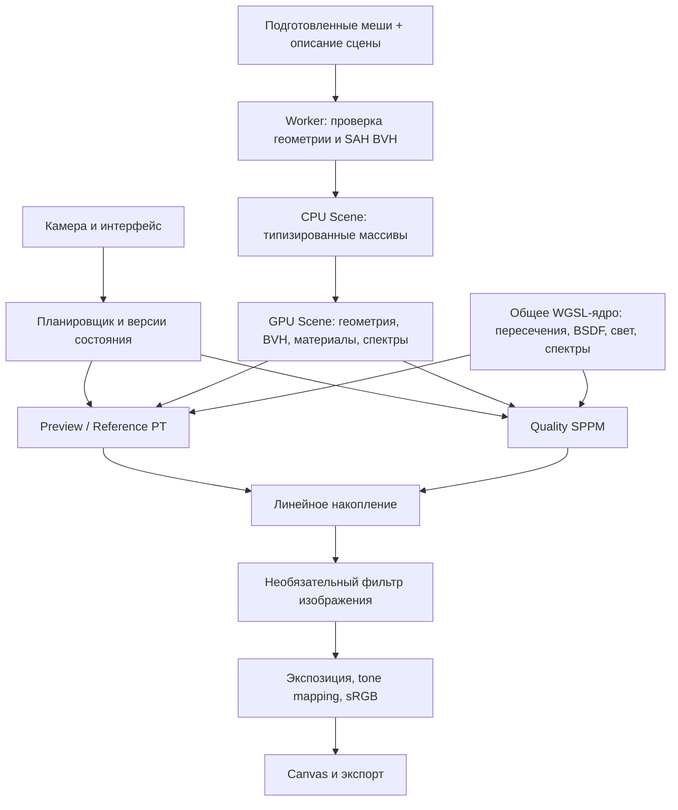

# Спектральный WebGPU-рендерер: коробка Корнелла со стеклянной Сюзанной

## 1. Результат и принятые решения

Создать браузерный движок с физически обоснованным освещением и прогрессивным накоплением изображения. Итоговая сцена — коробка Корнелла с красной и зелёной стенами, потолочным источником света и стеклянной Сюзанной в центре. Обязательны преломление, отражения, полное внутреннее отражение, поглощение, каустики и спектральная дисперсия.

Зафиксированные требования:

- Работа на встроенной GPU обязательна. Локальная Intel UHD Graphics — первая площадка проверки.
- Во время движения камеры используется облегчённый предпросмотр; после остановки качество постепенно растёт.
- Конечный продукт — переиспользуемое ядро и законченная демонстрация, без редактора и универсального импорта пользовательских сцен.
- Для ускорения каустик допустим progressive photon mapping с уменьшающимся пространственным сглаживанием.
- Отдельный path tracer сохраняется как альтернативный режим и средство проверки.

**Основное архитектурное решение — два интегратора на общем физическом ядре:**

| Режим | Назначение | Алгоритм |
|---|---|---|
| Preview | Взаимодействие с камерой | RGB path tracing, сниженное разрешение |
| Reference | Проверка результата и обычное накопление | Спектральный path tracing + NEE + MIS |
| Quality | Финальная сцена с каустиками | Спектральный stochastic progressive photon mapping — SPPM |

Reference здесь означает проверочный режим движка. Независимую проверку обеспечивают аналитические тесты и внешние эталонные изображения.

[Отчёт](deep-research-report.md) используется как основа, но объёмные среды, динамическая геометрия, универсальные материалы и импорт нескольких форматов исключаются из первой версии. Освободившаяся сложность направляется на стекло и каустики.

Современные ReSTIR PT Enhanced и ReSTIR BDPT учитывать при проектировании и сравнении подходов, но не включать в обязательную реализацию. Первый совершенствует переиспользование путей, второй специально расширяет его на сложные каустики; перенос этих систем в браузер — отдельная крупная задача. Для выбранной статической сцены и встроенной GPU SPPM представляется более управляемым инженерным компромиссом. Это выбор архитектуры, а не утверждение о превосходстве по производительности. [ReSTIR PT Enhanced](https://research.nvidia.com/labs/rtr/publication/lin2026restirptenhanced/), [ReSTIR BDPT](https://research.nvidia.com/labs/rtr/publication/hedstrom2025restir/).

## 2. Архитектура и интерфейсы

### Стек и границы модулей

- TypeScript со строгой проверкой типов, Vite, WGSL, `@webgpu/types`.
- `gl-matrix` для камеры и преобразований.
- Обычный DOM для интерфейса.
- Web Worker для подготовки геометрии и построения BVH.
- Vitest для CPU-математики и упаковки данных; браузерные GPU-тесты и Playwright для интерфейса.
- Blender используется только при подготовке ресурсов. Готовая сцена запускается без Blender и серверных вычислений.
- WASM, Three.js и полноценный render graph для первой версии не требуются.



Модули разделяются по ответственности:

| Модуль | Ответственность |
|---|---|
| `scene` | Геометрия, материалы, источники, камера; без DOM и GPU-объектов |
| `assets` | Загрузка подготовленных массивов, проверка формата и метаданных |
| `accel` | CPU-построение BVH, упаковка, диагностические проверки |
| `gpu` | Device, buffers, layouts, pipelines, освобождение ресурсов |
| `transport` | Общие WGSL-функции физики и два интегратора |
| `render` | Планировщик, накопление, реконструкция, вывод |
| `app` | Интерфейс, управление камерой, настройки, экспорт |
| `debug` | AOV, трассировка выбранного луча, статистика |

WGSL разбивается на небольшие исходники и собирается в несколько entry point через явную композицию строк. Общие функции пересечения и материалов используются обоими интеграторами.

### Минимальные контракты

```ts
type RenderMode = "preview" | "reference" | "quality";

interface SceneDescription {
  version: 1;
  meshes: MeshData[];
  objects: SceneObject[];
  materials: MaterialDescription[];
  lights: AreaLightDescription[];
  camera: CameraDescription;
}

interface Renderer {
  initialize(canvas: HTMLCanvasElement): Promise<void>;
  setScene(scene: SceneDescription): Promise<void>;
  setCamera(camera: CameraDescription): void;
  setSettings(settings: RenderSettings): void;
  resize(width: number, height: number): void;
  pause(): void;
  resume(): void;
  capture(): Promise<RenderCapture>;
  dispose(): void;
}
```

Материалы первой версии — tagged union: `diffuse`, `dielectric`, `emissive`. Стекло имеет модель IOR и спектр поглощения; материал не сводится к прозрачности `opacity`.

Контракт BSDF:

```text
evaluate(wo, wi, wavelength, transportMode) → f
pdf(wo, wi, wavelength) → probabilityDensity
sample(wo, random, wavelength, transportMode)
    → wi, weight, pdf, eventFlags, eta
```

`transportMode` различает перенос от камеры и от источника. Это необходимо для правильных коэффициентов при преломлении.

CPU/GPU-layout определяется WGSL-структурами и проверяется тестами смещений и размеров. Для упаковки используется reflection из `webgpu-utils`; отдельный генератор схем не создаётся.

### Версии состояния

- Камера, геометрия, материалы, свет, разрешение или настройки интегратора меняются → накопление соответствующего режима сбрасывается.
- Экспозиция и параметры отображения меняются → накопление сохраняется.
- Истории PT и SPPM раздельные; их численные оценки не смешиваются.
- Незавершённая итерация SPPM при изменении сцены отменяется целиком.
- Асинхронные Worker-результаты помечаются revision; устаревшие результаты не загружаются на GPU.

## 3. Рендеринг, стекло и ограничения браузера

### Геометрия и BVH

Для статической демонстрации использовать **один бинарный SAH BVH в мировых координатах**. Преобразования объектов запекаются при подготовке сцены. BLAS/TLAS пока не нужны: инстансинга и анимации в принятом объёме нет.

Начальные параметры:

- Binned SAH, 16 корзин.
- До 4 треугольников в обычном листе.
- Узел BVH — 32 байта.
- Ограничение глубины дерева и проверяемый стек обхода; при достижении предела builder создаёт лист.
- Обход ближайшего дочернего узла первым.
- Отдельные `closestHit` и `anyHit`.
- Устойчивые пересечения треугольников по общим рёбрам.
- Смещение начала вторичного луча с учётом погрешности и геометрической нормали.

Переполнение стека, нечисловые значения и выходы за диапазоны считаются диагностируемыми ошибками. Они не должны превращаться в пропущенные пересечения.

### Проверочный path tracer

Реализовать:

- Семплирование BSDF.
- Один NEE-сэмпл на недельта-поверхности.
- MIS с power heuristic.
- Корректный учёт попадания продолженного пути в источник.
- Russian roulette после пятого взаимодействия с компенсацией вероятности выживания.
- Отдельную обработку delta reflection/refraction.
- Детерминированный sampler с фиксированными измерениями: Owen-scrambled Sobol для камеры, спектра и взаимодействий.

Стартовые пределы глубины: Preview — 8, Quality — 32, Reference — 64. Это конечные ограничения вычислений; для финальной сцены обязательно сравнить глубины 32 и 64. Называть результат абсолютно несмещённым при конечной глубине нельзя.

Физическое ядро и MIS сверять с PBRT, включая поправку Russian roulette на изменение масштаба throughput при преломлении. [PBRT: A Better Path Tracer](https://pbr-book.org/4ed/Light_Transport_I_Surface_Reflection/A_Better_Path_Tracer).

### Стекло и спектр

Первая версия поддерживает полированное сплошное стекло:

- Точный диэлектрический Fresnel.
- Закон Снеллиуса и полное внутреннее отражение.
- Beer–Lambert: `T(λ, d) = exp(-σa(λ) · d)`.
- Различение геометрической и shading-нормали.
- Границы воздух/стекло определяются геометрией, а не shading-нормалью.
- Согласованные поправки для shading-нормалей и переноса от камеры/источника.
- Пересекающиеся и вложенные стеклянные объёмы исключены из версии 1.

Затемнение и окраска стекла должны зависеть от пройденного расстояния. Лучи видимости нельзя просто пропускать прямо через преломляющее стекло с коэффициентом прозрачности: соответствующий световой путь должен быть построен интегратором. [PBRT: Dielectric BSDF](https://www.pbr-book.org/4ed/Reflection_Models/Dielectric_BSDF).

**Спектральное упрощение для браузера:** один случайный wavelength на путь, а не пакет из четырёх. Диапазон — 360–830 нм; итог интегрируется в CIE XYZ с учётом плотности выбора длины волны.

Это уменьшает состояние луча и делает дисперсию однозначной. При пакетном подходе разные длины волн после преломления требуют расщепления либо корректного прекращения вторичных каналов. [PBRT: Sampled Wavelengths](https://www.pbr-book.org/4ed/Radiometry%2C_Spectra%2C_and_Color/Representing_Spectral_Distributions).

Для демонстрации:

- Табличные спектры отражения стен.
- Табличный белый источник.
- Пресет N-BK7: Sellmeier для IOR, поглощение из внутреннего пропускания.
- Единицы длины сцены — метры; перевод нанометров в микрометры для Sellmeier выполняется явно.
- Отдельный пресет без дисперсии нужен для сравнения.

Коэффициенты стекла брать из даташита производителя и включать источник в метаданные ресурса. Радужную окраску не усиливать искусственно в основном пресете. [SCHOTT: Optical Glass Data Sheets](https://www.schott.com/en-gb/products/optical-glass/-/media/Project/OnEx/Products/O/optical-glass/Downloads/schott-optical-glass-collection-datasheets-english-may2019.pdf?rev=5358bb64e13a44f2b37f5065490509af).

### Quality: спектральный SPPM

SPPM оценивает непрямое освещение через локальную плотность фотонов. При конечном радиусе оценка сглажена; радиус постепенно уменьшается. Прямой свет оценивается отдельно, поэтому нельзя просто прибавлять photon map к полному результату PT. [PBRT: Stochastic Progressive Photon Mapping](https://pbr-book.org/3ed-2018/Light_Transport_III_Bidirectional_Methods/Stochastic_Progressive_Photon_Mapping).

Одна итерация:

1. Выбрать общую длину волны для camera pass и photon pass.
2. Из камеры пройти цепочку зеркальных/преломляющих событий до первой диффузной поверхности.
3. Сохранить visible point, throughput камеры и прямое освещение.
4. Испустить заданное число фотонных путей из площадного источника.
5. Записать непрямые диффузные попадания; первые прямые попадания исключить из photon estimate.
6. Построить пространственный индекс.
7. Для каждого visible point собрать подходящие фотонные попадания.
8. Обновить статистику SPPM и вывести завершённую оценку.

После диффузного попадания фотон продолжает путь: это необходимо и для непрямого переноса каустик по комнате.

Хранить для пикселя `N`, `radius`, `tauXYZ`, сумму прямого света и число итераций. Использовать стандартное обновление SPPM с `α = 2/3`:

```text
Nnew = N + αM
Rnew = R · sqrt(Nnew / (N + M))
τnew = (τ + ΦXYZ) · Rnew² / R²
L = directMean + τ / (πR² · emittedPhotonCount)
```

При `M = 0` статистика радиуса не меняется. `ΦXYZ` уже содержит BSDF, throughput камеры и единственную спектральную поправку.

**Спектральная адаптация:** общая λ позволяет точно совмещать camera/light subpaths без поиска «похожих» длин волн. Спектральный PDF учитывается один раз для полного вклада; фотонный и камерный множители не делятся на него независимо. Длины волн стратифицируются между итерациями. Возможный общий цветовой шум ранних итераций проверяется отдельно.

**Реализация для WebGPU:**

- Фотонные пути обрабатываются ограниченными пакетами.
- Каждому пути заранее выделяются слоты по максимальной глубине — переполнение не приводит к отбрасыванию энергии.
- Пространственный hash строится отдельным GPU-проходом через целочисленные атомики.
- Суммирование света выполняет один invocation на visible point; float atomics не требуются.
- Коллизии hash разрешаются сравнением координат ячейки.
- Gather проверяет расстояние, нормаль и поверхность-получатель, чтобы исключить протекание света между стенами.
- Радиус обновляется один раз после всех пакетов итерации.
- В нормировке учитываются все испущенные пути, включая не попавшие в сцену.

Начальные настройки: радиус 1,5% размера коробки, 16 384 фотонных пути на итерацию, пакеты по 1 024 пути. Это параметры настройки, а не обещание определённой скорости.

### Память и планирование GPU

Использовать стандартные WebGPU compute shaders и программный BVH traversal. Базовый путь не зависит от аппаратного ray-tracing API, subgroups, `shader-f16` и float atomics.

Проверять реальные device limits. Для основного пути проектировать не более восьми storage-buffer bindings на shader stage, каждый binding — в пределах доступного лимита. Базовые значения 128 MiB для storage binding и 256 MiB для buffer не являются бюджетом всей доступной видеопамяти. [WebGPU limits](https://gpuweb.github.io/gpuweb/#limits).

| Профиль | Начальное внутреннее разрешение | Мягкий бюджет управляемых GPU-ресурсов |
|---|---:|---:|
| Integrated | 640×480; финальное 960×720 | 192 MiB |
| Desktop | До 1920×1080 | 384 MiB |

Соотношение сторон сохраняется; значения задают максимальную площадь, а не растяжение изображения.

- Линейное накопление — `f32`.
- Отображаемые промежуточные изображения — `rgba16float`.
- BVH и геометрия — storage buffers.
- Крупные массивы состояния разделяются по назначению; один binding не должен случайно превысить лимит при resize.
- При смене размера старые ресурсы освобождаются до выделения полного нового комплекта.
- При нехватке памяти сначала уменьшается внутреннее разрешение.
- 4K и неограниченный `devicePixelRatio` не входят в первую версию.

Планировщик запускает небольшие tile-dispatches и фотонные пакеты. Начальная цель — GPU-порции порядка 4–8 мс с последующей калибровкой. Число незавершённых submissions ограничивается; CPU не накапливает очередь на секунды вперёд.

`timestamp-query` используется при наличии. Без него измеряется грубое время завершения порций, которое не выдаётся за точное время GPU-прохода.

Переход к Quality начинается после 250 мс неподвижности камеры. Длительная итерация может занимать несколько экранных кадров. Фоновая вкладка приостанавливает работу.

### Реконструкция и отображение

- Raw accumulation хранится отдельно от фильтрованного изображения.
- На первом этапе — пространственный à-trous-фильтр с нормалями, глубиной и оценкой дисперсии.
- Движение камеры сбрасывает историю; temporal reprojection в эту версию не входит.
- Для пикселей, прошедших через стекло, первая нормаль не считается достаточной информацией о видимой сцене. По умолчанию сильное пространственное сглаживание там отключено.
- Каустики должны оставаться видимыми при полностью выключенном denoiser.
- Вывод: XYZ → linear sRGB → экспозиция → согласованный tone mapper → sRGB encoding.
- Экспорт: PNG отображения и PFM линейного RGB с JSON-метаданными настроек.

## 4. Порядок реализации

Каждый этап заканчивается работающим результатом и проверкой. Спектральные каустики проверяются на простой геометрии до художественной доводки Сюзанны.

| Этап | Реализация | Условие завершения |
|---|---|---|
| **1. Основание** | Проект, WebGPU initialization, compute-to-canvas, resize, диагностика, жизненный цикл ресурсов | Запуск на Intel UHD через доступный браузерный WebGPU; понятные ошибки при отсутствии поддержки |
| **2. Пересечения** | Камера, треугольники, Worker, SAH BVH, normal/depth debug views | CPU brute force и GPU BVH совпадают на фиксированном наборе лучей |
| **3. RGB PT** | Диффузная коробка, источник, NEE, MIS, RR, накопление | Корректные мягкие тени и перенос цвета; согласованные оценки разных способов семплирования |
| **4. Стекло** | Диэлектрик, Fresnel, TIR, поглощение, корректные границы | Проверены сфера, пластина и стеклянный объект без утечек и необъяснимых чёрных областей |
| **5. Спектральный PT** | λ-sampling, XYZ, спектры, Sellmeier | Призма разделяет спектр; стекло без дисперсии совпадает с соответствующим контрольным случаем |
| **6. RGB SPPM** | Camera pass, photons, hash, gather, progressive statistics | Каустика сферы сходится; энергия не зависит от разбиения фотонов на пакеты |
| **7. Спектральный SPPM** | Общая λ итерации, корректная спектральная нормировка | Спектральные каустики согласуются с независимым эталоном; отсутствует двойной учёт света |
| **8. Конечная сцена** | Подготовка замкнутой Сюзанны, материалы, свет, камера | Сцена визуально завершена в raw-режиме |
| **9. Интерактивность** | Preview/Quality switching, бюджеты, denoiser, интерфейс, экспорт | Камера отзывчива, память ограничена, старые результаты не попадают в новый кадр |
| **10. Приёмка** | GPU-профилирование, сравнение изображений, browser matrix, документация | Воспроизводимый запуск и зафиксированные показатели качества/производительности |

### Подготовка конечной сцены

- Коробка размером 2×2×2 м, открытая спереди.
- Красная левая стена, зелёная правая, нейтральные остальные поверхности.
- Один прямоугольный потолочный источник; окружение чёрное.
- Сюзанна центрируется по bounding box в центре коробки, ширина около 1,2 м.
- Начальная камера — перед открытой стороной, направлена в центр, вертикальный FOV около 40°.
- Дополнительные кубы и декоративные объекты не добавляются.

Для Сюзанны подготовить один замкнутый стеклянный объём. Скрипт подготовки должен объединить проблемные части, устранить отверстия и внутренние поверхности, проверить ориентацию и самопересечения, затем выполнить subdivision и triangulation.

Бюджет — ориентировочно 50–100 тысяч треугольников. Снижение детализации допускается только после проверки силуэта и отражений. Готовый меш, исходник подготовки и метаданные происхождения хранятся в проекте.

Спектры стен можно взять из открытых данных Cornell; масштабированная демонстрация с Сюзанной при этом не объявляется точной реконструкцией измерительного стенда. [Cornell: Geometry and Reflectance Data](https://bowers.cornell.edu/computer-graphics/data).

### Интерфейс демонстрации

Минимальная панель:

- Orbit, zoom, reset camera.
- Preview / Reference / Quality.
- Разрешение и пауза накопления.
- Экспозиция и denoiser on/off.
- Дисперсия on/off.
- Число samples либо итераций и испущенных фотонов.
- Время накопления, оценка памяти и доступные GPU timings.
- Экспорт.
- Debug views: normal, depth, material, wavelength, path length, BVH visits, photon density.

## 5. Проверки, приёмка и границы

### Физика и численная корректность

Обязательные тесты:

- BVH против brute force, включая лучи вдоль граней AABB и общих рёбер треугольников.
- Fresnel при нормальном и скользящем падении.
- Критический угол и полное внутреннее отражение.
- Преломление через параллельную пластину.
- Beer–Lambert при нескольких толщинах.
- Сохранение энергии на диффузных и стеклянных контрольных сценах.
- Совпадение средних оценок MIS, light sampling и BSDF sampling в пределах статистической ошибки.
- Согласованность `radiance`/`importance` при прохождении стекла.
- Правильная нормировка wavelength sampling и XYZ.

### Проверки каустик

Использовать последовательность: стеклянная сфера → призма → Сюзанна.

- Сравнить PT и SPPM на одинаковой сцене и материалах.
- Менять размер фотонного пакета при неизменном общем числе путей: результат не должен систематически менять яркость.
- Проверить случаи нулевых попаданий, hash-коллизий и прерывания итерации.
- Проверить границы стен и углы на утечки и избыточное затемнение.
- Отключение дисперсии должно убирать спектральное разделение, сохраняя обычную каустику.
- Уменьшение радиуса должно уточнять структуру, а не бесконтрольно увеличивать энергию.

Спектральный SPPM — наиболее рискованный этап. До его приёмки сравнение выполнять на малом разрешении с независимым CPU-эталоном и спектральным рендером PBRT той же геометрии. Внешний эталон использует совпадающие спектры, масштаб и параметры камеры.

### Качество изображения

Хранить контрольные сцены, фиксированные seed, linear reference images и настройки их получения.

Измерять:

- RMSE линейной яркости.
- Ошибку средней энергии по областям.
- Ошибку отдельно в области каустики.
- Сходимость по времени и числу путей.
- Влияние глубины, радиуса и denoiser.

Начальные критерии для контрольных сцен: расхождение средней энергии до 2% на простых диффузных случаях и до 5% в интегральной области каустики после достаточного накопления. Эталон должен иметь статистическую погрешность существенно ниже этих порогов.

Для финальной картинки обязательны читаемый стеклянный объём, отражения стен, преломлённый фон, контактно согласованный свет и каустика без фильтра. Точная длительность накопления определяется измерениями; конкретный FPS до реализации не обещается.

### Браузер и эксплуатация

Первая обязательная платформа — desktop Chrome/Edge с доступным стандартным WebGPU. Firefox/Safari проверяются по возможности и получают документированный статус, без обещания совместимости до испытаний.

Проверить:

- Resize и высокий DPR.
- Потерю device и восстановление ресурсов из CPU-сцены.
- Отсутствие optional features.
- Ограниченные device limits.
- Многократную смену режима и сцены без роста памяти.
- Паузу, возврат из фоновой вкладки, отмену устаревших задач.
- Запуск через localhost и статический HTTPS-хостинг.

Результатом проекта должны стать исходники движка, готовая сцена, воспроизводимая подготовка ресурсов, тестовые сцены, экспортированные контрольные кадры и документация с фактическими показателями на Intel UHD.

**За пределами первой версии:** rough glass, объёмное рассеяние, вложенные среды, текстурный PBR, пользовательский импорт, анимация, TLAS/refit, wavefront queues, ReSTIR, neural denoising, 4K и мобильная оптимизация. Их добавление не является условием завершения выбранной сцены.
